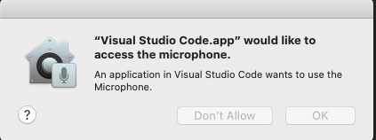

# Speech Recognition 🎙🔊

## Libraries 📚
- conda env: `DataScience` 

|LIBRARY|INFO|INSTALLATION|RESULTS|
|--|--|--|--|
|`PyAudio`|With PyAudio, you can easily use Python to play and record audio|`brew install portaudio` & `pip install pyaudio`||  
|`pyttsx3`|a text-to-speech conversion library in Python. Unlike alternative libraries, it works offline, and is compatible with both Python 2 and 3.|`pip install pyttsx3`|✅|    

